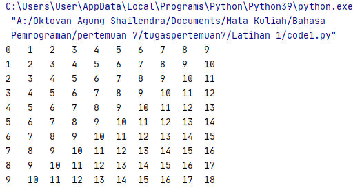
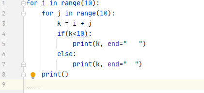
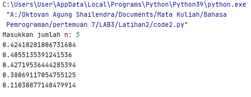
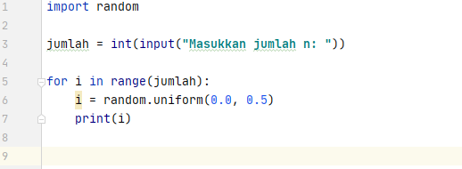

# Tugas Pertemuan 7

## LATIHAN 1



### JAWABAN

    - Buka text editor seperti, PyCharm, Visual Studio Code, Atom, dan lain - lain. Kemudian salinkode berikut :


``` python

for i in range(10):
    for j in range(10):
        k = i + j
        if(k<10):
            print(k, end="   ")
        else:
            print(k, end="  ")
    print()
```



- kemudian simpan dengan nama `code1.py`, lalu jalankan program tersebut, maka akan menampilkan output seperti gambar di bawah ini :


### PENJELASAN
* Pada baris pertama dan ke dua program `code1.py`, terdapat fungsi `for` yang merupakan jenis perulangan yang terhitung / _counted loop_.

* Variabel `i` dan `j` pada baris ke - 1 dan 2 berfungsi untuk menampilkan indeks. Sedangkan fungsi `range(10)` berfungsi untuk membuat list antara 0 sampai 10.

* Pada baris ke - 3 nilai dari variabel `i` ditambah dengan nilai dari variabel `j`. Kemudian disimpan pada variabel `k`.

* Baris ke - 4 klaus `if` sebagai pemilihan kondisi, contohnya : Jika nilai pada variabel `k` hasilnya **kurang dari 10**, maka jalankan baris ke - 5 pada program.

* Dan di baris ke - 5 merupakan lanjutan dari `if`.`print` untuk mencetak nilai dari variabel `k` ke layar, kemudian fungsi `end="   "` untuk memberi jarak / spasi 3 kali ke kanan.

* Program berjalan dan terus melakukan  _looping_. Namun jikaperintah pada baris ke - 4 tidak terpenuhi / nilai `k` **lebih besar dari 10**, maka program akan lompat ke baris ke - 6.

* Dibaris ke - 6 klause `else` sebahai jalan terakhir apabila klause `if` tidak terpenuhi.

* Baris ke - 7 merupakan lanjutan dari `else`. `print` untuk mencetak nilai dari variabel `k` ke layar, kemudian fungsi `end="  "` untuk memberi jarak / spasi 2 kali ke kanan.

* Baris ke - 8 `print()` berfungsi apabila perulangan pertama pada variabel `i` telah dilakukan, maka tampilkan ke layar. Contohnya :<br>
```0 1 2 3 4 5 6 7 8 9```<br>

* Program akan terus melakukan _looping_ dari baris pertama hingga ke - 8, sampai nilai dari variabel `i` telah mencapai list ke - 10.

```
0   1   2   3   4   5   6   7   8   9   
1   2   3   4   5   6   7   8   9   10  
2   3   4   5   6   7   8   9   10  11  
3   4   5   6   7   8   9   10  11  12  
4   5   6   7   8   9   10  11  12  13  
5   6   7   8   9   10  11  12  13  14  
6   7   8   9   10  11  12  13  14  15  
7   8   9   10  11  12  13  14  15  16  
8   9   10  11  12  13  14  15  16  17  
9   10  11  12  13  14  15  16  17  18
```

## LATIHAN 2



## JAWABAN

* Buka text editor seperti, PyCharm, Visual Studio Code, Atom, dan lain - lain. Kemudian salin kode berikut :

``` python
import random

jumlah = int(input("Masukkan jumlah n: "))

for i in range(jumlah):
    i = random.uniform(0.0, 0.5)
    print(i)

```



* Kemudian simpan dengan nama `code2.py`, lalu jalankan program tersebut. Maka akan menampilkan output seperti gambar di bawah ini :


## Penjelasan

* Pada baris pertama program `code2.py`, tertulis `import random` yang berarti kita meng-impor modul / _library_ bawaan dari python bernama **random**. Modul ini berisi bilangan acak, dengan bentuk **float**.

* Baris ke - 3, mendeklarasikan `jumlah` sebagai variabel untuk menyimpan nilai / jumlah yang akan kita masukkan nanti. Dan `int` merubah bentuk yang sebelumnya  _string_ menjadi _integer_.

* Baris ke - 5, `for` merupakan perulangan, dan `i` untuk menampung indeks. `range(jumlah)` sebagai list akan mengikuti jumlah yang kita masukkan pada baris ke - 3.

* Baris ke - 6, mendeklarasikan kembali variabel `i`, dan `random.uniform(0.0, 0.5)` untuk menampilkan nilai acak dari yang telah di tentukan, yaitu antara **0.0** sampai **0.5**.

* Baris ke - 7, `print(i)` untuk menampilkan nilai acak dari `i` di baris 6 ke layar.

* Kemudian program akan terus berulang sampai nilai dari **jumlah** yang kita inputkan tadi terpenuhi.

## TERIMA KASIH